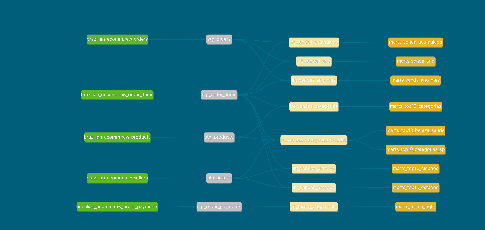

# Brazilian E-Commerce Analytics Pipeline (dbt)

## 📌 Contexto do Projeto

Este projeto tem como objetivo construir um **pipeline analítico completo** utilizando **PostgreSQL + dbt**, partindo de dados brutos locais até a entrega de **marts analíticos prontos para consumo**.

A base de dados utilizada é o **Brazilian E-Commerce Public Dataset by Olist**, disponibilizado publicamente no Kaggle:

* Fonte: Kaggle – Brazilian E-Commerce Public Dataset by Olist
* Período: **2016 a 2018**
* Volume: ~100 mil pedidos
* Domínio: Marketplace / E-commerce

O dataset permite analisar o ciclo completo de um pedido, incluindo:

* Pedidos
* Itens vendidos
* Pagamentos
* Produtos
* Vendedores
* Localização geográfica

📎 Fonte oficial: [https://www.kaggle.com/datasets/olistbr/brazilian-ecommerce](https://www.kaggle.com/datasets/olistbr/brazilian-ecommerce)

---

## 🏗️ Arquitetura do Projeto

O projeto segue uma arquitetura clássica de **Analytics Engineering**, separando claramente responsabilidades por camada:

```
📦 Data Sources (CSV local)
      ↓ EL
🗄️ PostgreSQL (raw tables)
      ↓ T (dbt)
🧱 Staging
      ↓
🔧 Intermediate
      ↓
📊 Marts
```

A modelagem relacional original do dataset pode ser visualizada no diagrama abaixo:


---

## ⚙️ Tecnologias Utilizadas

* **PostgreSQL** – Banco de dados relacional
* **dbt Core** – Transformações e documentação
* **Python** – Processo de carga (EL)
* **Airflow** – Orquestração do pipeline
* **Docker / Docker Compose** – Isolamento de ambiente
* **Git / GitHub** – Versionamento
* **VS Code** – Ambiente de desenvolvimento

---

## 🚀 Etapas do Projeto

### 1️⃣ Extração (Extract)

Os dados foram baixados diretamente do Kaggle em formato **CSV** e armazenados localmente.

Arquivos utilizados:

* `raw_orders.csv`
* `raw_order_items.csv`
* `raw_order_payments.csv`
* `raw_products.csv`
* `raw_sellers.csv`
* `raw_customers.csv`
* `raw_geolocation.csv`


---

### 2️⃣ Carga (Load)

Os arquivos CSV foram carregados no **PostgreSQL** como tabelas raw, preservando o esquema original dos dados.

Boas práticas aplicadas:

* Tipagem adequada de colunas
* Nenhuma regra de negócio aplicada nesta etapa
* Estrutura preparada para consumo pelo dbt

Resultado:

```
raw.raw__orders
raw.raw_order_items
raw.raw_order_payments
raw.raw_products
raw.raw_sellers
raw.raw_customers
raw.raw_geolocation
```

---

### 3️⃣ Transformação (Transform – dbt)

As transformações foram realizadas utilizando **dbt**, organizadas em três camadas principais:

---

## 🧱 Camada Staging

🎯 Objetivo:

* Limpeza
* Padronização
* Renomeação de colunas
* Aplicação de testes básicos

Características:

* 1 modelo por tabela raw
* Nenhuma agregação
* Granularidade idêntica à fonte

Exemplos:

* `stg_orders`
* `stg_order_items`
* `stg_order_payments`
* `stg_products`
* `stg_sellers`

Testes aplicados:

* `not_null`
* `unique`
* `relationships`

---

## 🔧 Camada Intermediate

🎯 Objetivo:

* Aplicar regras de negócio
* Realizar joins entre entidades
* Criar métricas base reutilizáveis

Características:

* Agregações controladas
* Métricas consolidadas
* Modelos reutilizáveis pelos marts

Principais modelos:

* Vendas por ano
* Vendas por ano-mês
* Vendas por categoria
* Vendas por cidade / estado
* Forma de pagamento
* Vendas acumuladas

Essa camada atua como **fundação analítica** do projeto.

---

## 📊 Camada Marts

🎯 Objetivo:

* Entregar dados prontos para análise
* Responder perguntas de negócio
* Servir BI, dashboards e stakeholders

Características:

* Modelos finais
* Linguagem de negócio
* Granularidade explícita via `meta.grain`

Principais marts criados:

* `marts_forma_pgto`
* `marts_top10_categorias`
* `marts_top10_cidades`
* `marts_top10_estados`
* `marts_venda_ano`
* `marts_venda_ano_mes`
* `marts_venda_acumulada`

---

Linhagem final de todas as camadas criadas:



---

### 🔹 Diagrama Atualizado do Pipeline
```
+-------------------+       +--------------------+       +--------------------+
|  CSV Local Files  |  EL   |   PostgreSQL Raw   |  T    |      dbt Models    |
| orders, products, | ----> |  raw tables        | ----> | Staging /          |
| payments, etc.    |       |                    |       | Intermediate / Marts|
+-------------------+       +--------------------+       +--------------------+
           |                          |                        |
           |                          |                        |
           v                          v                        v
   +-------------------+       +--------------------+       +--------------------+
   |  Docker Compose   |       |    Airflow DAGs    |       |    dbt Docs        |
   | Postgres / Airflow|<----->| orchestrating EL+T |       | HTML Documentation |
   |  Volumes / Logs   |       |                    |       |                    |
   +-------------------+       +--------------------+       +--------------------+
```
--

## 📈 Perguntas de Negócio Respondidas

Com base nos marts desenvolvidos, o projeto responde perguntas como:

### 💳 Pagamentos

* Quais são as formas de pagamento mais utilizadas?
* Qual a representatividade percentual de cada forma?

### 🛒 Vendas

* Como as vendas evoluíram ao longo do tempo?
* Qual o acumulado de vendas mês a mês?
* Qual o ticket médio por período?

### 🗺️ Geografia

* Quais estados possuem maior volume de vendas?
* Quais cidades concentram as maiores vendas?

### 📦 Produtos

* Quais são as categorias mais vendidas?
* Quais categorias se destacam em São Paulo?
* Como se comportam preço médio e volume por categoria?

--

## 📚 Documentação

Toda a documentação foi gerada utilizando **dbt docs**, incluindo:

* Descrição de modelos
* Descrição de colunas
* Granularidade (`meta.grain`)
* Camada (`meta.layer`)

Para visualizar:

```bash
dbt docs generate
dbt docs serve
```

---

## 💻 Como Rodar o Pipeline Localmente

Siga estas instruções para rodar **o pipeline completo** na sua máquina, incluindo PostgreSQL, Airflow, EL com Python e T com dbt.

---

### 1️⃣ Pré-requisitos

Antes de começar, instale os seguintes softwares:

* [Docker](https://www.docker.com/get-started)
* [Docker Compose](https://docs.docker.com/compose/install/)
* [Git](https://git-scm.com/)
* (Opcional) VS Code ou outro editor de código

> Certifique-se de que as portas 5432 (Postgres), 8080 (Airflow) e 8081 (dbt docs) estão livres.

---

### 2️⃣ Clonar o repositório

```bash
git clone https://github.com/seu-usuario/brazilian_ecomm_dw.git
cd brazilian_ecomm_dw
```

### 3️⃣ Configurar variáveis e credenciais

* Se existir, copie .env.example para .env:

```bash
cp .env.example .env
```

### 4️⃣ Subir o ambiente Docker

```bash
docker compose up -d
```

Isso vai criar e iniciar:

* PostgreSQL (banco de dados)

* Airflow (scheduler, webserver e worker)

* Volumes persistentes para dados e logs

Verifique se os containers estão rodando:

```bash
docker ps
```

### 5️⃣ Acessar Airflow

* Abra http://localhost:8080 no navegador

* Usuário/senha padrão: airflow / airflow

* DAG principal: brazilian_ecomm_pipeline

* É possível executar manualmente ou configurar agendamento

### 6️⃣ Executar dbt dentro do container

Entre no container do Airflow:

```bash
docker exec -it airflow-webserver bash
cd /opt/airflow/brazilian_ecomm
```

Execute os comandos dbt:

```bash
# Rodar todas as transformações
dbt run

# Gerar documentação
dbt docs generate

# Servir documentação via web
dbt docs serve --port 8081
```

* A documentação estará disponível em http://localhost:8081

* Caso a porta 8081 já esteja em uso, escolha outra porta:

```bash
dbt docs serve --port 8082
```

### 7️⃣ Parar e limpar o ambiente

Para parar os containers e liberar recursos:

```bash
docker compose down
```

Para remover volumes e dados persistentes (opcional):

```bash
docker compose down -v
```

### 🔧 Dicas úteis

* Logs do Airflow:

```bash
docker logs -f airflow-webserver
docker logs -f airflow-scheduler
```

* Se houver conflitos de portas, altere no docker-compose.yml ou no comando dbt.

* Sempre garanta que os dados CSV estejam na pasta data/raw antes de rodar o EL.

## 🧠 Conclusão

Este projeto demonstra um pipeline analítico completo, seguindo boas práticas de:

* Modelagem analítica
* Analytics Engineering
* Governança de dados
* Documentação orientada a negócio

Ele pode ser facilmente estendido para:

* Dashboards em Power BI / Looker / Tableau
* Integração com novas fontes
* Casos avançados de analytics e ciência de dados

---

📌 **Autor:** Raphael Pylypiec
📌 **Stack:** PostgreSQL • dbt • Python • Airflow • Docker
